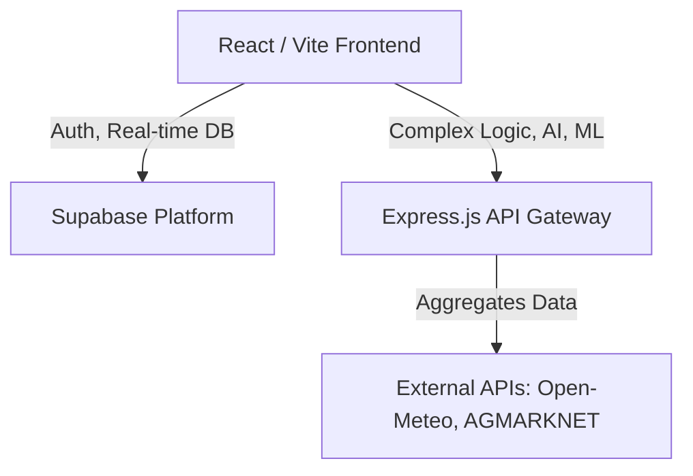

# System Architecture

## 1. High-Level Overview
KhedutMitra employs a modern, decoupled architecture optimizing for high performance, ease of localization, and scalable data management.

## 2. Frontend Architecture
- **Framework:** React 18 with Vite for lightning-fast HMR and optimized builds.
- **Language:** TypeScript for strict type safety.
- **State Management:** React Context (for Auth, Language, Theme) and React Query for server state caching.
- **Styling:** Tailwind CSS using the predefined Magic Patterns design system (e.g., `text-brand`, `bg-canvas`).
- **Routing:** React Router v6.

## 3. Backend Architecture
- **BaaS:** Supabase provides PostgreSQL, Row Level Security (RLS), Edge Functions, and Authentication (Phone+Password).
- **Custom API Gateway:** Node.js/Express service deployed on Render, handling heavy integrations:
  - Aggregating external market APIs.
  - Processing AI advisory requests (OpenAI/Anthropic integration).
  - Handling image processing for disease detection.

## 4. Design Decisions
- **Why Supabase over Firebase?** Strong relational data requirements (Farmers, Crops, Bids, Communities) map better to PostgreSQL. RLS ensures strict data privacy.
- **Why Vite?** Superior developer experience and build times for a hackathon environment.
